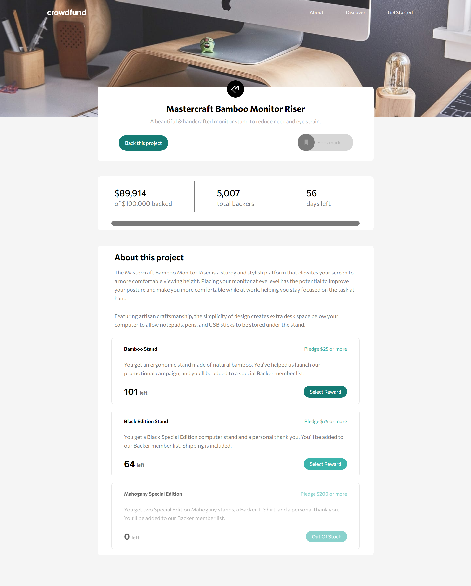

# Frontend Mentor - Crowdfunding product page solution

This is a solution to the [Crowdfunding product page challenge on Frontend Mentor](https://www.frontendmentor.io/challenges/crowdfunding-product-page-7uvcZe7ZR). Frontend Mentor challenges help you improve your coding skills by building realistic projects.

## Table of contents


  - [The challenge](#the-challenge)
  - [Screenshot](#screenshot)
  - [Links](#links)
- [My process](#my-process)
  - [Built with](#built-with)
  - [What I learned](#what-i-learned)
- [Author](#author)


### The challenge

Users should be able to:

- View the optimal layout depending on their device's screen size
- See hover states for interactive elements
- Make a selection of which pledge to make
- See an updated progress bar and total money raised based on their pledge total after confirming a pledge
- See the number of total backers increment by one after confirming a pledge
- Toggle whether or not the product is bookmarked

### Screenshot




### Links

- Solution URL: [Github Repository](https://github.com/Codedzephyr/Crowdfunding-product-page-main)
- Live Site URL: [Live Site URL](https://sad-lumiere-ebcc40.netlify.app/)

## My process

### Built with

- Semantic HTML5 markup
- CSS custom properties
- Flexbox
- Mobile-first workflow


### What I learned

Use this section to recap over some of your major learnings while working through this project. Writing these out and providing code samples of areas you want to highlight is a great way to reinforce your own knowledge.

To see how you can add code snippets, see below:

```html
<div class="navbar-brand">
  
  
  <div class="close-container" id="close-container">
    
  </div>
</div>
```

```css
section.overall-container {
  display: grid;
  place-items: center;
  width: 100%;
  position: relative;
  top: -100px;
}

.main-section {
  width: 100%;
  display: grid;
  place-items: center;
}
```

```js
var currencyRemoval = parseInt(donatedAmount.replace(/[^0-9\.-]+/g, ""));
var convertedTotalBackers = parseInt(totalBackers.replace(/,/g, ""));
totalDonation = amountDonated + currencyRemoval1;
totalCalculations = totalDonation
  .toString()
  .replace(/\B(?=(\d{3})+(?!\d))/g, ",");
console.log(totalCalculations);
document.getElementById("donated-amount").innerHTML = `$${totalCalculations}`;
```

## Author

- Website - [Salihu Andulhamid](https://infallible-pike-a0b433.netlify.app/)
- Frontend Mentor - [@Codedzephyr](https://www.frontendmentor.io/profile/Codedzephyr)
- Twitter - [@dimah](https://www.twitter.com/_Dimah__)

## Acknowledgments

This is where you can give a hat tip to anyone who helped you out on this project. Perhaps you worked in a team or got some inspiration from someone else's solution. This is the perfect place to give them some credit.

**Note: Delete this note and edit this section's content as necessary. If you completed this challenge by yourself, feel free to delete this section entirely.**
